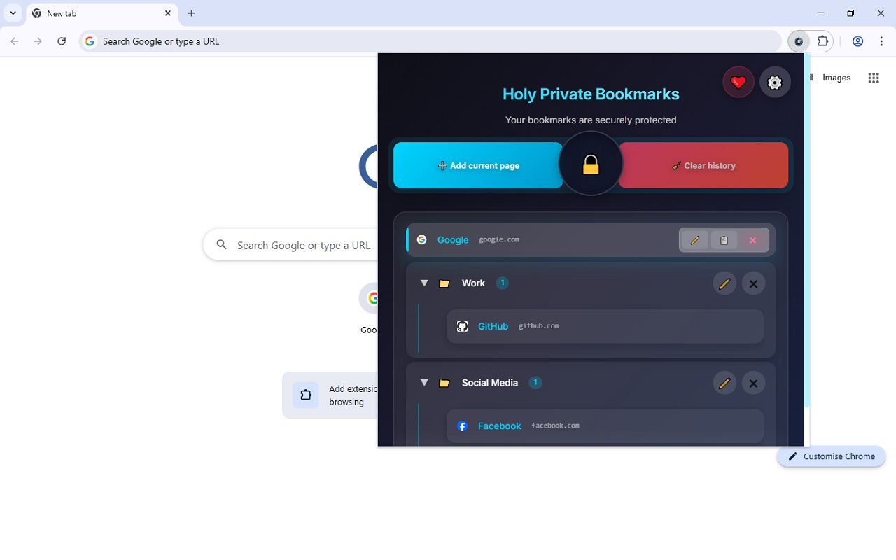

# Holy Private Bookmarks

**Fully encrypted private bookmarks right in your browser.**

A Chrome extension that stores your bookmarks locally in fully encrypted form.  
No one except you (not even us) can read them — everything is encrypted with a master password using AES-GCM.

## Features

- Full bookmark encryption (AES-GCM + PBKDF2)
- No servers — everything is stored locally
- Import from standard Chrome bookmarks
- Support for folders and nested structure
- Context menu for quick bookmark adding
- Auto-lock after 10 minutes of inactivity
- Clear browsing history for domains present in bookmarks

## Screenshots

## Installation

[Install from Chrome Web Store](https://chromewebstore.google.com/detail/holy-private-bookmarks/nnafnomgekidkehbgkfmhapccelgdbch)

Or load it manually:
1. Download a release or clone the repository
2. Open `chrome://extensions`
3. Enable "Developer mode"
4. Click "Load unpacked" and select the folder

## License

The project is released under the **[WTFPL v2](http://www.wtfpl.net/)** license — do whatever you want.

> DO WHAT THE FUCK YOU WANT TO.

## Support the Project

If you find the extension useful, any support is greatly appreciated:

- Bitcoin (BTC): `bc1q9rz9uu9c48ydrmgrmu9kzqjp9mrdzavcll09uq`
- Ethereum (ETH): `0xAc862138b1ebF8d7F4fdb23D821489Cf91c314d0`

❤️ Thank you!
